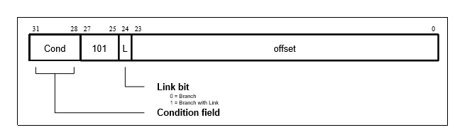

# ARMv7-Emulator

## Description
This is an ARMv7 Emulator written in C that runs specific assembly files. ARMv7 is a RISC assembly language used in some older ARM 32-bit processors. This emulator uses the official ARMv7 documentation to create the different opcodes, condition codes, and instruction formats.

The emulator supports four different instruction types: 

1) Data Processing Instructions - Responsible for handling arithmetic and logical operations on registers. The format for this type of instruction looks like the following:

2) Memory Processing Instructions (Specifically Single Data Transfer, ldr & str) - This type of instruction loads and stores data
from memory. The format for memory processing instrucitons is completely different from the data processing instructions:

3) Branch and bl instructions - Branch instructions allow the program to move to different lines and also call functions (bl). Like the other two instruction types, branches have their own format for instructions. 

4) The "return" instruction, branch and exchange, has its own special format as well:

